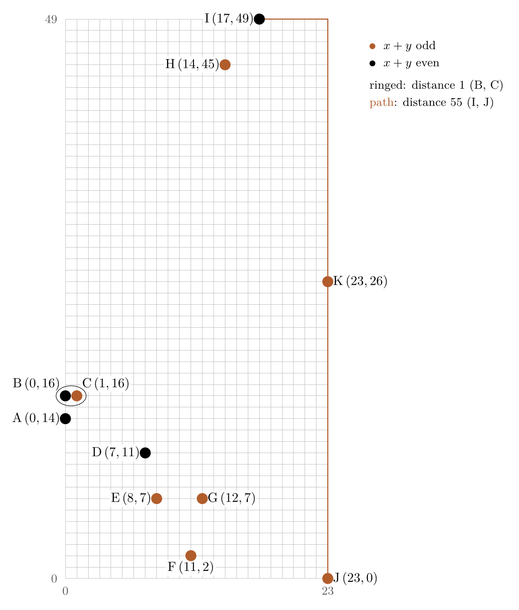

# Eleven points with all taxicab distances different

<!-- visual:start -->

<b>Eleven lattice points whose 55 taxicab distances are exactly 1 to 55: the case n = 11 of an open question.</b>

<a href="https://github.com/jvvk/mathematics">all results</a>

<!-- visual:end -->

Eleven lattice points whose 55 pairwise taxicab distances are exactly 1, 2, ..., 55.

| Point | A | B | C | D | E | F | G | H | I | J | K |
|---|---|---|---|---|---|---|---|---|---|---|---|
| (x, y) | (0,14) | (0,16) | (1,16) | (7,11) | (8,7) | (11,2) | (12,7) | (14,45) | (17,49) | (23,0) | (23,26) |

The taxicab distance between (x1, y1) and (x2, y2) is |x1 - x2| + |y1 - y2|. The closest pair is B, C (distance 1) and the farthest is I, J (distance 55).

This answers the case n = 11 of the Mathematics Stack Exchange question [The existence of patterns with unique pairwise distances](https://math.stackexchange.com/q/4967838) ([answer](https://math.stackexchange.com/a/5150779)).

## Licence

The figure and the coordinates are released under [CC BY 4.0](LICENSE).
